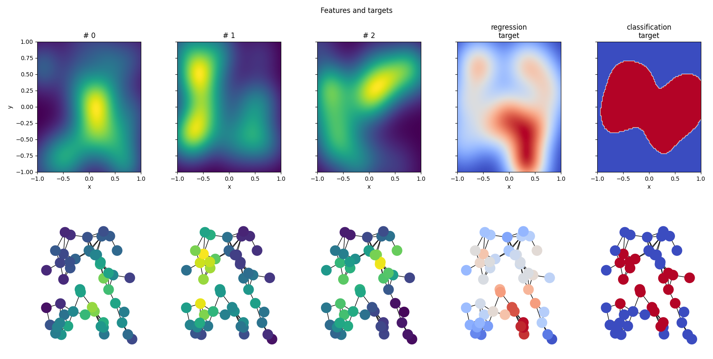

# graph-nns-fun
Custom graph neural networks examples.

## Synthetic graph data
Let's generate some graph data and visualize it.
### Gaussian landscape
We create a gaussian landscape feature map, generate a random graph and project the landscape onto the graph. Since we used a low frequency feature map now we have a graph where neighbouring nodes have similar features.

