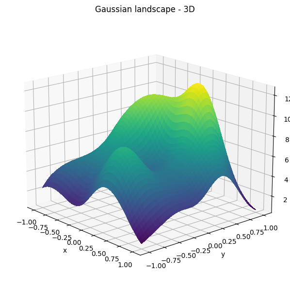

# graph-nns-fun
Custom graph neural networks examples.

## Synthetic graph data
Let's generate some graph data and visualize it.
### Gaussian landscape

This is a gaussian landscape. It's a sum of a few guassians. We're gonna project a graph onto it.

  

We create a few gaussian landscape feature maps, generate a random graph and project the landscape onto the graph. Since we used a low frequency feature map now we have a graph where neighbouring nodes have similar features.

This should give us a good basis for creating a synthetic graph dataset that's easy to visualize.

## TODOs
- [ ] Create a datasets by multiplying feature maps with noise $v \\sim U (0.9, 1.1)$
- [ ] train an MLP
- [ ] train a few GNNs
- [ ] compare
- [ ] use wandb sweeps

